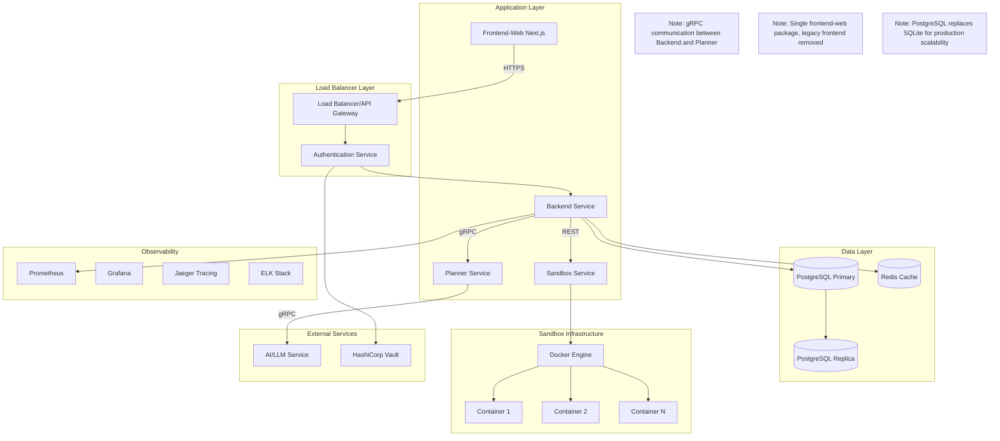
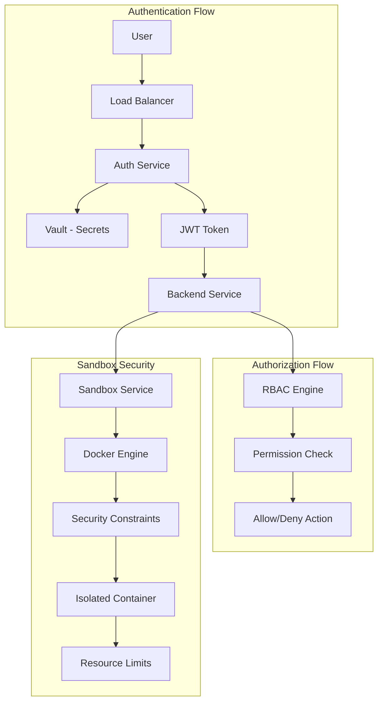

# Design Document - System Hardening & Production Readiness

## Overview

This design document outlines the comprehensive hardening of the Isekai AI Agent System to transform it from a development prototype into a production-ready platform. The design first addresses critical architecture inconsistencies that prevent the system from functioning as designed, then tackles 56+ identified issues across security, architecture, performance, and reliability domains while maintaining the system's core functionality and microservices architecture.

**Critical Architecture Fixes:**
- Implement proper gRPC communication between backend and planner services as documented
- Resolve frontend package ambiguity by consolidating to Next.js application
- Fix CI pipeline integrity by removing failure-masking statements
- Update data models to reflect actual domain rather than generic examples
- Migrate from SQLite to PostgreSQL for production scalability

**Production Hardening:**
The solution implements enterprise-grade security with JWT authentication and Docker-based sandbox isolation, adds comprehensive observability with OpenTelemetry and Prometheus, and implements resilience patterns including circuit breakers and distributed transaction management.

## Architecture

### High-Level Architecture



### Security Architecture



## Components and Interfaces

### Authentication Service

#### JWT Authentication Implementation

```typescript
interface AuthenticationService {
  // Core authentication methods
  authenticate(credentials: UserCredentials): Promise<AuthResult>;
  validateToken(token: string): Promise<TokenValidation>;
  refreshToken(refreshToken: string): Promise<AuthResult>;
  revokeToken(token: string): Promise<void>;
  
  // Security features
  checkAccountLockout(userId: string): Promise<boolean>;
  recordFailedAttempt(userId: string): Promise<void>;
  resetFailedAttempts(userId: string): Promise<void>;
}

interface UserCredentials {
  username: string;
  password: string;
  mfaToken?: string;
}

interface AuthResult {
  accessToken: string;
  refreshToken: string;
  expiresIn: number;
  user: UserProfile;
}

interface TokenValidation {
  valid: boolean;
  user?: UserProfile;
  permissions: Permission[];
  expiresAt: Date;
}

interface UserProfile {
  id: string;
  username: string;
  email: string;
  roles: Role[];
  quotas: ResourceQuotas;
}
```

#### Role-Based Access Control (RBAC)

```typescript
interface RBACService {
  checkPermission(userId: string, resource: string, action: string): Promise<boolean>;
  getUserRoles(userId: string): Promise<Role[]>;
  assignRole(userId: string, roleId: string): Promise<void>;
  revokeRole(userId: string, roleId: string): Promise<void>;
}

interface Role {
  id: string;
  name: string;
  permissions: Permission[];
  description: string;
}

interface Permission {
  resource: string; // 'app', 'sandbox', 'admin'
  actions: string[]; // 'create', 'read', 'update', 'delete'
  conditions?: PermissionCondition[];
}

interface PermissionCondition {
  field: string;
  operator: 'equals' | 'in' | 'greater_than';
  value: any;
}
```

### gRPC Communication Implementation

#### Planner Service gRPC Server

```typescript
// packages/planner/src/grpc-server.ts
import * as grpc from '@grpc/grpc-js';
import { PlannerService } from '../generated/agent_messages_grpc_pb';
import { PlanInput, PlanOutput, PlanStep } from '../generated/agent_messages_pb';
import { IntentAnalyzer } from './services/intentAnalyzer';
import { CodeGenerator } from './services/codeGenerator';

class PlannerServiceImpl implements PlannerService {
  private analyzer = new IntentAnalyzer();
  private generator = new CodeGenerator();

  async plan(
    call: grpc.ServerUnaryCall<PlanInput, PlanOutput>,
    callback: grpc.sendUnaryData<PlanOutput>
  ): Promise<void> {
    try {
      const request = call.request;
      const goal = request.getGoal();
      const context = request.getContext();
      const meta = request.getMeta();

      // Analyze intent and generate plan
      const intent = this.analyzer.analyze(goal, context);
      const code = this.generator.generate(intent);

      // Create response
      const response = new PlanOutput();
      response.setMeta(meta);

      // Convert plan to PlanStep objects
      const steps = intent.plan.map((step: any, index: number) => {
        const planStep = new PlanStep();
        planStep.setId(`step_${index}`);
        planStep.setAction(step.action);
        planStep.setTool(step.tool || 'code_generator');
        planStep.setPayload(JSON.stringify(step.payload || code));
        return planStep;
      });

      response.setStepsList(steps);
      callback(null, response);
    } catch (error) {
      callback({
        code: grpc.status.INTERNAL,
        message: `Planning failed: ${error.message}`
      });
    }
  }
}

export function startGrpcServer(port: number = 50051): grpc.Server {
  const server = new grpc.Server();
  
  server.addService(PlannerService, new PlannerServiceImpl());
  
  server.bindAsync(
    `0.0.0.0:${port}`,
    grpc.ServerCredentials.createInsecure(),
    (error, port) => {
      if (error) {
        console.error('Failed to start gRPC server:', error);
        return;
      }
      console.log(`Planner gRPC server started on port ${port}`);
      server.start();
    }
  );
  
  return server;
}
```

#### Backend Service gRPC Client

```typescript
// packages/backend/src/services/plannerClient.ts
import * as grpc from '@grpc/grpc-js';
import { PlannerClient } from '../generated/agent_messages_grpc_pb';
import { PlanInput, PlanOutput, RequestMeta } from '../generated/agent_messages_pb';

export class PlannerGrpcClient {
  private client: PlannerClient;

  constructor(serverAddress: string = 'localhost:50051') {
    this.client = new PlannerClient(
      serverAddress,
      grpc.credentials.createInsecure()
    );
  }

  async plan(goal: string, context: string, userId: string): Promise<any> {
    return new Promise((resolve, reject) => {
      const request = new PlanInput();
      request.setGoal(goal);
      request.setContext(context);

      const meta = new RequestMeta();
      meta.setRequestId(this.generateRequestId());
      meta.setUserId(userId);
      meta.setTsUnixMs(Date.now());
      request.setMeta(meta);

      this.client.plan(request, (error, response) => {
        if (error) {
          reject(new Error(`gRPC call failed: ${error.message}`));
          return;
        }

        const steps = response.getStepsList().map(step => ({
          id: step.getId(),
          action: step.getAction(),
          tool: step.getTool(),
          payload: JSON.parse(step.getPayload())
        }));

        resolve({
          requestId: response.getMeta()?.getRequestId(),
          steps
        });
      });
    });
  }

  private generateRequestId(): string {
    return `req_${Date.now()}_${Math.random().toString(36).substr(2, 9)}`;
  }

  close(): void {
    this.client.close();
  }
}
```

### Enhanced Sandbox Service

#### Docker-Based Isolation

```typescript
interface SandboxService {
  // Container management
  createContainer(config: ContainerConfig): Promise<Container>;
  startContainer(containerId: string): Promise<ContainerStatus>;
  stopContainer(containerId: string): Promise<void>;
  removeContainer(containerId: string): Promise<void>;
  
  // Resource management
  setResourceLimits(containerId: string, limits: ResourceLimits): Promise<void>;
  getResourceUsage(containerId: string): Promise<ResourceUsage>;
  
  // Security
  applySecurityConstraints(containerId: string): Promise<void>;
  validateFileAccess(path: string, allowedPaths: string[]): boolean;
}

interface ContainerConfig {
  image: string;
  command: string[];
  workingDir: string;
  environment: Record<string, string>;
  resourceLimits: ResourceLimits;
  securityOptions: SecurityOptions;
  networkMode: 'none' | 'bridge' | 'host';
}

interface ResourceLimits {
  memory: number; // bytes
  cpu: number; // CPU units (1000 = 1 CPU)
  diskSpace: number; // bytes
  processes: number;
  executionTime: number; // seconds
}

interface SecurityOptions {
  readOnlyRootfs: boolean;
  noNewPrivileges: boolean;
  capabilities: {
    drop: string[];
    add: string[];
  };
  seccompProfile: string;
  apparmorProfile: string;
}
```

#### Path Validation & Security

```typescript
class SecurePathValidator {
  private allowedPaths: Set<string>;
  
  constructor(allowedPaths: string[]) {
    this.allowedPaths = new Set(allowedPaths.map(p => path.resolve(p)));
  }
  
  async validatePath(inputPath: string): Promise<string> {
    // Normalize and resolve path
    const normalizedPath = path.normalize(inputPath);
    
    // Check for dangerous patterns
    if (this.containsDangerousPatterns(normalizedPath)) {
      throw new SecurityError('Dangerous path pattern detected', 'PATH_TRAVERSAL');
    }
    
    // Resolve to canonical path
    const canonicalPath = await fs.realpath(path.dirname(normalizedPath));
    const fullPath = path.join(canonicalPath, path.basename(normalizedPath));
    
    // Verify within allowed paths
    const isAllowed = Array.from(this.allowedPaths).some(allowedPath => 
      fullPath.startsWith(allowedPath)
    );
    
    if (!isAllowed) {
      throw new SecurityError('Path outside allowed directories', 'PATH_TRAVERSAL');
    }
    
    return fullPath;
  }
  
  private containsDangerousPatterns(path: string): boolean {
    const dangerousPatterns = [
      /\.\./,           // Parent directory
      /^\/+/,           // Absolute path
      /\0/,             // Null byte
      /[<>:"|?*]/,      // Windows reserved chars
      /\$\{.*\}/,       // Variable expansion
      /`.*`/,           // Command substitution
    ];
    
    return dangerousPatterns.some(pattern => pattern.test(path));
  }
}
```

### Database Migration & Management

#### PostgreSQL Migration Strategy

```typescript
interface DatabaseService {
  // Migration management
  runMigrations(): Promise<MigrationResult[]>;
  rollbackMigration(version: string): Promise<void>;
  getMigrationStatus(): Promise<MigrationStatus[]>;
  
  // Connection management
  getConnection(): Promise<PoolClient>;
  healthCheck(): Promise<DatabaseHealth>;
  
  // Transaction management
  beginTransaction(): Promise<Transaction>;
  commitTransaction(tx: Transaction): Promise<void>;
  rollbackTransaction(tx: Transaction): Promise<void>;
}

interface MigrationResult {
  version: string;
  name: string;
  status: 'success' | 'failed' | 'skipped';
  executionTime: number;
  error?: string;
}

interface DatabaseHealth {
  connected: boolean;
  primaryAvailable: boolean;
  replicaAvailable: boolean;
  connectionCount: number;
  maxConnections: number;
  replicationLag?: number;
}
```

#### Optimistic Locking Implementation

```typescript
interface VersionedEntity {
  id: string;
  version: number;
  updatedAt: Date;
}

class OptimisticLockingService<T extends VersionedEntity> {
  constructor(private db: DatabaseService, private tableName: string) {}
  
  async update(id: string, expectedVersion: number, updates: Partial<T>): Promise<T> {
    const tx = await this.db.beginTransaction();
    
    try {
      // Check current version
      const current = await this.findById(id, tx);
      if (!current) {
        throw new NotFoundError(`Entity ${id} not found`);
      }
      
      if (current.version !== expectedVersion) {
        throw new ConcurrentModificationError(
          `Expected version ${expectedVersion}, found ${current.version}`
        );
      }
      
      // Update with version increment
      const updated = await this.performUpdate(id, updates, tx);
      await this.db.commitTransaction(tx);
      
      return updated;
    } catch (error) {
      await this.db.rollbackTransaction(tx);
      throw error;
    }
  }
  
  private async performUpdate(id: string, updates: Partial<T>, tx: Transaction): Promise<T> {
    const setClause = Object.keys(updates)
      .map(key => `${key} = $${key}`)
      .join(', ');
    
    const query = `
      UPDATE ${this.tableName} 
      SET ${setClause}, version = version + 1, updated_at = NOW()
      WHERE id = $id AND version = $expectedVersion
      RETURNING *
    `;
    
    const result = await tx.query(query, { ...updates, id });
    return result.rows[0];
  }
}
```

### Service Communication & Resilience

#### Circuit Breaker Implementation

```typescript
interface CircuitBreakerService {
  execute<T>(operation: () => Promise<T>, config: CircuitBreakerConfig): Promise<T>;
  getState(operationName: string): CircuitBreakerState;
  reset(operationName: string): void;
}

interface CircuitBreakerConfig {
  name: string;
  failureThreshold: number;
  recoveryTimeout: number;
  timeout: number;
  fallback?: () => Promise<any>;
}

enum CircuitBreakerState {
  CLOSED = 'closed',
  OPEN = 'open',
  HALF_OPEN = 'half_open'
}

class CircuitBreaker {
  private failures = 0;
  private lastFailureTime?: Date;
  private state = CircuitBreakerState.CLOSED;
  
  constructor(private config: CircuitBreakerConfig) {}
  
  async execute<T>(operation: () => Promise<T>): Promise<T> {
    if (this.state === CircuitBreakerState.OPEN) {
      if (this.shouldAttemptReset()) {
        this.state = CircuitBreakerState.HALF_OPEN;
      } else {
        return this.executeFallback();
      }
    }
    
    try {
      const result = await this.executeWithTimeout(operation);
      this.onSuccess();
      return result;
    } catch (error) {
      this.onFailure();
      throw error;
    }
  }
  
  private async executeWithTimeout<T>(operation: () => Promise<T>): Promise<T> {
    return Promise.race([
      operation(),
      new Promise<T>((_, reject) =>
        setTimeout(() => reject(new TimeoutError('Operation timeout')), this.config.timeout)
      )
    ]);
  }
  
  private onSuccess(): void {
    this.failures = 0;
    this.state = CircuitBreakerState.CLOSED;
  }
  
  private onFailure(): void {
    this.failures++;
    this.lastFailureTime = new Date();
    
    if (this.failures >= this.config.failureThreshold) {
      this.state = CircuitBreakerState.OPEN;
    }
  }
  
  private shouldAttemptReset(): boolean {
    if (!this.lastFailureTime) return false;
    
    const timeSinceLastFailure = Date.now() - this.lastFailureTime.getTime();
    return timeSinceLastFailure >= this.config.recoveryTimeout;
  }
  
  private async executeFallback<T>(): Promise<T> {
    if (this.config.fallback) {
      return this.config.fallback();
    }
    throw new ServiceUnavailableError(`${this.config.name} is unavailable`);
  }
}
```

#### Distributed Transaction Management (Saga Pattern)

```typescript
interface SagaService {
  execute(saga: SagaDefinition): Promise<SagaResult>;
  compensate(sagaId: string): Promise<void>;
  getStatus(sagaId: string): Promise<SagaStatus>;
}

interface SagaDefinition {
  id: string;
  steps: SagaStep[];
  timeout: number;
}

interface SagaStep {
  name: string;
  action: () => Promise<any>;
  compensation: () => Promise<void>;
  retryPolicy?: RetryPolicy;
}

interface SagaResult {
  id: string;
  status: 'completed' | 'failed' | 'compensated';
  completedSteps: string[];
  error?: Error;
}

class SagaOrchestrator {
  private executedSteps: Map<string, any[]> = new Map();
  
  async execute(saga: SagaDefinition): Promise<SagaResult> {
    const executedSteps: string[] = [];
    
    try {
      for (const step of saga.steps) {
        const result = await this.executeStep(step);
        executedSteps.push(step.name);
        this.recordStepExecution(saga.id, step.name, result);
      }
      
      return {
        id: saga.id,
        status: 'completed',
        completedSteps: executedSteps
      };
    } catch (error) {
      await this.compensate(saga.id, executedSteps, saga.steps);
      
      return {
        id: saga.id,
        status: 'compensated',
        completedSteps: executedSteps,
        error: error as Error
      };
    }
  }
  
  private async executeStep(step: SagaStep): Promise<any> {
    const retryPolicy = step.retryPolicy || { maxAttempts: 1, backoffMs: 0 };
    
    for (let attempt = 1; attempt <= retryPolicy.maxAttempts; attempt++) {
      try {
        return await step.action();
      } catch (error) {
        if (attempt === retryPolicy.maxAttempts) {
          throw error;
        }
        
        await this.delay(retryPolicy.backoffMs * Math.pow(2, attempt - 1));
      }
    }
  }
  
  private async compensate(sagaId: string, executedSteps: string[], allSteps: SagaStep[]): Promise<void> {
    const stepsToCompensate = executedSteps.reverse();
    
    for (const stepName of stepsToCompensate) {
      const step = allSteps.find(s => s.name === stepName);
      if (step) {
        try {
          await step.compensation();
        } catch (error) {
          logger.error(`Compensation failed for step ${stepName}:`, error);
        }
      }
    }
  }
  
  private recordStepExecution(sagaId: string, stepName: string, result: any): void {
    if (!this.executedSteps.has(sagaId)) {
      this.executedSteps.set(sagaId, []);
    }
    this.executedSteps.get(sagaId)!.push({ stepName, result, timestamp: new Date() });
  }
  
  private delay(ms: number): Promise<void> {
    return new Promise(resolve => setTimeout(resolve, ms));
  }
}
```

## Data Models

### Domain-Specific Data Models

#### Prisma Schema for Isekai Domain

```prisma
// packages/frontend-web/prisma/schema.prisma
generator client {
  provider = "prisma-client-js"
}

datasource db {
  provider = "postgresql"
  url      = env("DATABASE_URL")
}

model User {
  id                   String   @id @default(cuid())
  username             String   @unique
  email                String   @unique
  passwordHash         String
  salt                 String
  accountStatus        String   @default("active") // active, locked, suspended
  failedLoginAttempts  Int      @default(0)
  lastLoginAt          DateTime?
  createdAt            DateTime @default(now())
  updatedAt            DateTime @updatedAt
  version              Int      @default(1)
  
  // Relationships
  apps                 App[]
  roles                UserRole[]
  quotas               ResourceQuota?
  auditLogs            AuditLog[]
  
  @@map("users")
}

model Role {
  id          String   @id @default(cuid())
  name        String   @unique
  description String?
  permissions Json     // Store permissions as JSON
  createdAt   DateTime @default(now())
  updatedAt   DateTime @updatedAt
  
  // Relationships
  users       UserRole[]
  
  @@map("roles")
}

model UserRole {
  userId    String
  roleId    String
  assignedAt DateTime @default(now())
  assignedBy String?
  
  user      User @relation(fields: [userId], references: [id], onDelete: Cascade)
  role      Role @relation(fields: [roleId], references: [id], onDelete: Cascade)
  
  @@id([userId, roleId])
  @@map("user_roles")
}

model App {
  id           String    @id @default(cuid())
  userId       String
  name         String
  prompt       String
  status       String    // generating, running, stopped, error
  previewUrl   String?
  containerId  String?
  createdAt    DateTime  @default(now())
  updatedAt    DateTime  @updatedAt
  version      Int       @default(1)
  
  // Relationships
  user         User      @relation(fields: [userId], references: [id], onDelete: Cascade)
  code         GeneratedCode[]
  iterations   Iteration[]
  executions   ExecutionLog[]
  resourceUsage ResourceUsage?
  
  @@map("apps")
}

model GeneratedCode {
  id        String   @id @default(cuid())
  appId     String
  files     Json     // Store file structure as JSON
  framework String?
  language  String?
  version   Int      @default(1)
  createdAt DateTime @default(now())
  
  // Relationships
  app       App      @relation(fields: [appId], references: [id], onDelete: Cascade)
  
  @@map("generated_code")
}

model Iteration {
  id          String   @id @default(cuid())
  appId       String
  prompt      String
  changes     Json     // Store changes as JSON
  status      String   // pending, applied, failed
  appliedAt   DateTime?
  createdAt   DateTime @default(now())
  
  // Relationships
  app         App      @relation(fields: [appId], references: [id], onDelete: Cascade)
  
  @@map("iterations")
}

model ExecutionLog {
  id          String   @id @default(cuid())
  appId       String
  logLevel    String   // info, warn, error, debug
  message     String
  metadata    Json?
  timestamp   DateTime @default(now())
  
  // Relationships
  app         App      @relation(fields: [appId], references: [id], onDelete: Cascade)
  
  @@map("execution_logs")
}

model ResourceQuota {
  id                  String @id @default(cuid())
  userId              String @unique
  maxApps             Int    @default(10)
  maxConcurrentApps   Int    @default(3)
  maxMemoryPerApp     Int    @default(512) // MB
  maxCpuPerApp        Int    @default(1000) // CPU units
  maxStoragePerApp    Int    @default(1024) // MB
  maxExecutionTime    Int    @default(300) // seconds
  
  // Relationships
  user                User   @relation(fields: [userId], references: [id], onDelete: Cascade)
  
  @@map("resource_quotas")
}

model ResourceUsage {
  id            String   @id @default(cuid())
  appId         String   @unique
  cpu           Float    @default(0)
  memory        Int      @default(0) // MB
  storage       Int      @default(0) // MB
  networkIn     Int      @default(0) // bytes
  networkOut    Int      @default(0) // bytes
  executionTime Int      @default(0) // seconds
  lastUpdated   DateTime @default(now())
  
  // Relationships
  app           App      @relation(fields: [appId], references: [id], onDelete: Cascade)
  
  @@map("resource_usage")
}

model AuditLog {
  id            String   @id @default(cuid())
  userId        String?
  action        String
  resource      String
  resourceId    String?
  details       Json?
  ipAddress     String?
  userAgent     String?
  correlationId String?
  timestamp     DateTime @default(now())
  success       Boolean  @default(true)
  error         String?
  
  // Relationships
  user          User?    @relation(fields: [userId], references: [id], onDelete: SetNull)
  
  @@map("audit_logs")
}
```

#### TypeScript Interfaces

```typescript
interface User {
  id: string;
  username: string;
  email: string;
  passwordHash: string;
  salt: string;
  accountStatus: 'active' | 'locked' | 'suspended';
  failedLoginAttempts: number;
  lastLoginAt?: Date;
  createdAt: Date;
  updatedAt: Date;
  version: number;
  roles?: UserRole[];
  quotas?: ResourceQuota;
}

interface App {
  id: string;
  userId: string;
  name: string;
  prompt: string;
  status: 'generating' | 'running' | 'stopped' | 'error';
  previewUrl?: string;
  containerId?: string;
  createdAt: Date;
  updatedAt: Date;
  version: number;
  code?: GeneratedCode[];
  iterations?: Iteration[];
  resourceUsage?: ResourceUsage;
}

interface GeneratedCode {
  id: string;
  appId: string;
  files: Record<string, string>;
  framework?: string;
  language?: string;
  version: number;
  createdAt: Date;
}

interface Iteration {
  id: string;
  appId: string;
  prompt: string;
  changes: any;
  status: 'pending' | 'applied' | 'failed';
  appliedAt?: Date;
  createdAt: Date;
}

interface ExecutionLog {
  id: string;
  appId: string;
  logLevel: 'info' | 'warn' | 'error' | 'debug';
  message: string;
  metadata?: any;
  timestamp: Date;
}

interface ResourceQuota {
  id: string;
  userId: string;
  maxApps: number;
  maxConcurrentApps: number;
  maxMemoryPerApp: number;
  maxCpuPerApp: number;
  maxStoragePerApp: number;
  maxExecutionTime: number;
}

interface ResourceUsage {
  id: string;
  appId: string;
  cpu: number;
  memory: number;
  storage: number;
  networkIn: number;
  networkOut: number;
  executionTime: number;
  lastUpdated: Date;
}
```

### Audit and Security Models

```typescript
interface AuditLog {
  id: string;
  userId?: string;
  action: string;
  resource: string;
  resourceId?: string;
  details: Record<string, any>;
  ipAddress: string;
  userAgent: string;
  correlationId: string;
  timestamp: Date;
  success: boolean;
  error?: string;
}

interface SecurityEvent {
  id: string;
  type: 'authentication_failure' | 'authorization_failure' | 'suspicious_activity' | 'security_violation';
  severity: 'low' | 'medium' | 'high' | 'critical';
  userId?: string;
  details: Record<string, any>;
  ipAddress: string;
  timestamp: Date;
  resolved: boolean;
  resolvedAt?: Date;
  resolvedBy?: string;
}
```

## Error Handling

### Structured Error System

```typescript
abstract class AppError extends Error {
  abstract readonly code: string;
  abstract readonly statusCode: number;
  abstract readonly isOperational: boolean;
  
  constructor(
    message: string,
    public readonly details?: Record<string, any>,
    public readonly correlationId?: string
  ) {
    super(message);
    Error.captureStackTrace(this, this.constructor);
  }
  
  toJSON() {
    return {
      code: this.code,
      message: this.message,
      details: this.details,
      correlationId: this.correlationId,
      timestamp: new Date().toISOString()
    };
  }
}

class ValidationError extends AppError {
  readonly code = 'VALIDATION_ERROR';
  readonly statusCode = 400;
  readonly isOperational = true;
}

class AuthenticationError extends AppError {
  readonly code = 'AUTHENTICATION_ERROR';
  readonly statusCode = 401;
  readonly isOperational = true;
}

class AuthorizationError extends AppError {
  readonly code = 'AUTHORIZATION_ERROR';
  readonly statusCode = 403;
  readonly isOperational = true;
}

class SecurityError extends AppError {
  readonly code = 'SECURITY_ERROR';
  readonly statusCode = 403;
  readonly isOperational = true;
}

class ServiceUnavailableError extends AppError {
  readonly code = 'SERVICE_UNAVAILABLE';
  readonly statusCode = 503;
  readonly isOperational = true;
}

class ConcurrentModificationError extends AppError {
  readonly code = 'CONCURRENT_MODIFICATION';
  readonly statusCode = 409;
  readonly isOperational = true;
}
```

### Centralized Error Handler

```typescript
class ErrorHandler {
  constructor(
    private logger: Logger,
    private metricsService: MetricsService
  ) {}
  
  handle(error: Error, req: Request, res: Response, next: NextFunction): void {
    const correlationId = req.headers['x-correlation-id'] as string || uuidv4();
    
    // Log error with context
    this.logError(error, req, correlationId);
    
    // Record metrics
    this.recordErrorMetrics(error, req);
    
    // Send response
    if (error instanceof AppError) {
      this.handleOperationalError(error, res, correlationId);
    } else {
      this.handleUnexpectedError(error, res, correlationId);
    }
  }
  
  private logError(error: Error, req: Request, correlationId: string): void {
    const logData = {
      correlationId,
      error: {
        name: error.name,
        message: error.message,
        stack: error.stack,
        ...(error instanceof AppError && { code: error.code, details: error.details })
      },
      request: {
        method: req.method,
        path: req.path,
        query: req.query,
        headers: this.sanitizeHeaders(req.headers),
        userId: req.user?.id
      }
    };
    
    if (error instanceof AppError && error.isOperational) {
      this.logger.warn('Operational error occurred', logData);
    } else {
      this.logger.error('Unexpected error occurred', logData);
    }
  }
  
  private recordErrorMetrics(error: Error, req: Request): void {
    const labels = {
      method: req.method,
      path: req.route?.path || req.path,
      error_type: error.constructor.name,
      ...(error instanceof AppError && { error_code: error.code })
    };
    
    this.metricsService.incrementCounter('http_errors_total', labels);
  }
  
  private handleOperationalError(error: AppError, res: Response, correlationId: string): void {
    res.status(error.statusCode).json({
      error: error.code,
      message: error.message,
      correlationId,
      ...(process.env.NODE_ENV === 'development' && { details: error.details })
    });
  }
  
  private handleUnexpectedError(error: Error, res: Response, correlationId: string): void {
    res.status(500).json({
      error: 'INTERNAL_SERVER_ERROR',
      message: 'An unexpected error occurred',
      correlationId
    });
  }
  
  private sanitizeHeaders(headers: any): any {
    const sanitized = { ...headers };
    delete sanitized.authorization;
    delete sanitized.cookie;
    return sanitized;
  }
}
```

## Testing Strategy

### Comprehensive Testing Framework

```typescript
interface TestingFramework {
  // Unit testing
  runUnitTests(): Promise<TestResults>;
  generateCoverageReport(): Promise<CoverageReport>;
  
  // Integration testing
  runIntegrationTests(): Promise<TestResults>;
  setupTestDatabase(): Promise<void>;
  teardownTestDatabase(): Promise<void>;
  
  // End-to-end testing
  runE2ETests(): Promise<TestResults>;
  setupTestEnvironment(): Promise<void>;
  
  // Performance testing
  runLoadTests(config: LoadTestConfig): Promise<PerformanceResults>;
  runStressTests(config: StressTestConfig): Promise<PerformanceResults>;
  
  // Security testing
  runSecurityTests(): Promise<SecurityTestResults>;
  runPenetrationTests(): Promise<PenetrationTestResults>;
  
  // Chaos engineering
  runChaosTests(config: ChaosTestConfig): Promise<ChaosTestResults>;
}

interface TestResults {
  passed: number;
  failed: number;
  skipped: number;
  duration: number;
  failures: TestFailure[];
}

interface CoverageReport {
  lines: CoverageMetrics;
  functions: CoverageMetrics;
  branches: CoverageMetrics;
  statements: CoverageMetrics;
}

interface CoverageMetrics {
  total: number;
  covered: number;
  percentage: number;
}
```

### Test Implementation Examples

```typescript
// Unit test example
describe('AuthenticationService', () => {
  let authService: AuthenticationService;
  let mockUserRepository: jest.Mocked<UserRepository>;
  let mockHashService: jest.Mocked<HashService>;
  let mockTokenService: jest.Mocked<TokenService>;
  
  beforeEach(() => {
    mockUserRepository = createMockUserRepository();
    mockHashService = createMockHashService();
    mockTokenService = createMockTokenService();
    
    authService = new AuthenticationService(
      mockUserRepository,
      mockHashService,
      mockTokenService
    );
  });
  
  describe('authenticate', () => {
    it('should return valid token for correct credentials', async () => {
      const credentials = { username: 'testuser', password: 'password123' };
      const user = createTestUser({ username: 'testuser' });
      
      mockUserRepository.findByUsername.mockResolvedValue(user);
      mockHashService.verify.mockResolvedValue(true);
      mockTokenService.generate.mockResolvedValue('valid-token');
      
      const result = await authService.authenticate(credentials);
      
      expect(result.accessToken).toBe('valid-token');
      expect(result.user.username).toBe('testuser');
    });
    
    it('should throw AuthenticationError for invalid credentials', async () => {
      const credentials = { username: 'testuser', password: 'wrongpassword' };
      
      mockUserRepository.findByUsername.mockResolvedValue(null);
      
      await expect(authService.authenticate(credentials))
        .rejects.toThrow(AuthenticationError);
    });
    
    it('should implement account lockout after failed attempts', async () => {
      const credentials = { username: 'testuser', password: 'wrongpassword' };
      const user = createTestUser({ failedLoginAttempts: 4 });
      
      mockUserRepository.findByUsername.mockResolvedValue(user);
      mockHashService.verify.mockResolvedValue(false);
      
      await expect(authService.authenticate(credentials))
        .rejects.toThrow(AuthenticationError);
      
      expect(mockUserRepository.updateFailedAttempts).toHaveBeenCalledWith(
        user.id, 5
      );
    });
  });
});

// Integration test example
describe('App Generation Integration', () => {
  let app: Application;
  let database: Database;
  let testUser: User;
  
  beforeAll(async () => {
    app = await createTestApp();
    database = await setupTestDatabase();
    testUser = await createTestUser();
  });
  
  afterAll(async () => {
    await teardownTestDatabase();
  });
  
  it('should generate app end-to-end', async () => {
    const token = await generateTestToken(testUser);
    
    const response = await request(app)
      .post('/api/apps/generate')
      .set('Authorization', `Bearer ${token}`)
      .send({
        prompt: 'Create a CSV viewer application',
        context: { framework: 'react' }
      })
      .expect(201);
    
    expect(response.body).toMatchObject({
      id: expect.any(String),
      name: expect.any(String),
      status: 'generating',
      userId: testUser.id
    });
    
    // Wait for generation to complete
    await waitForAppStatus(response.body.id, 'running', 30000);
    
    const completedApp = await database.getApp(response.body.id);
    expect(completedApp.status).toBe('running');
    expect(completedApp.previewUrl).toMatch(/^http:\/\/localhost:\d+$/);
  });
});
```

This design provides a comprehensive foundation for transforming the Isekai system into a production-ready platform while maintaining its core functionality and architectural principles.