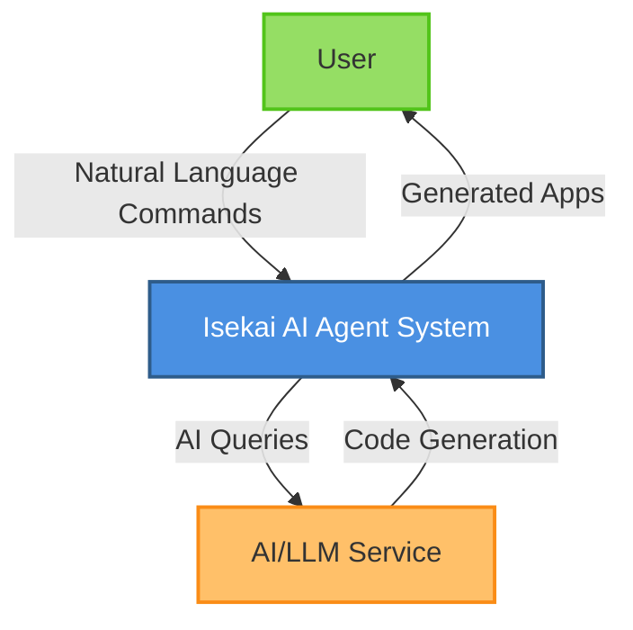
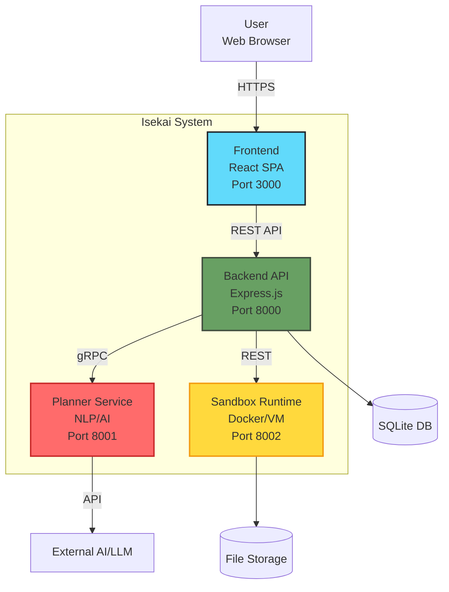
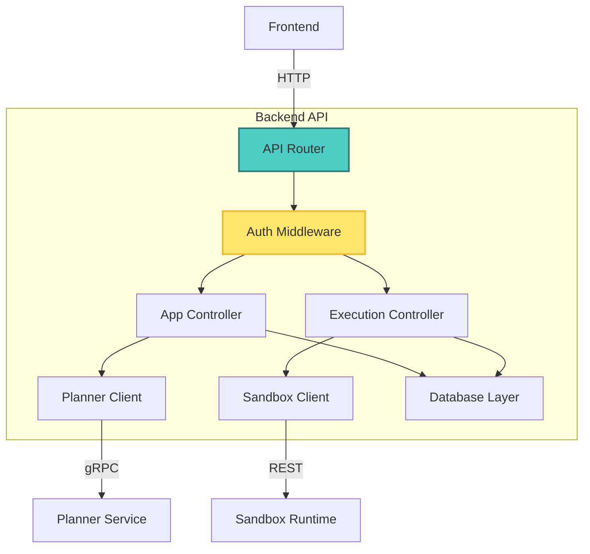
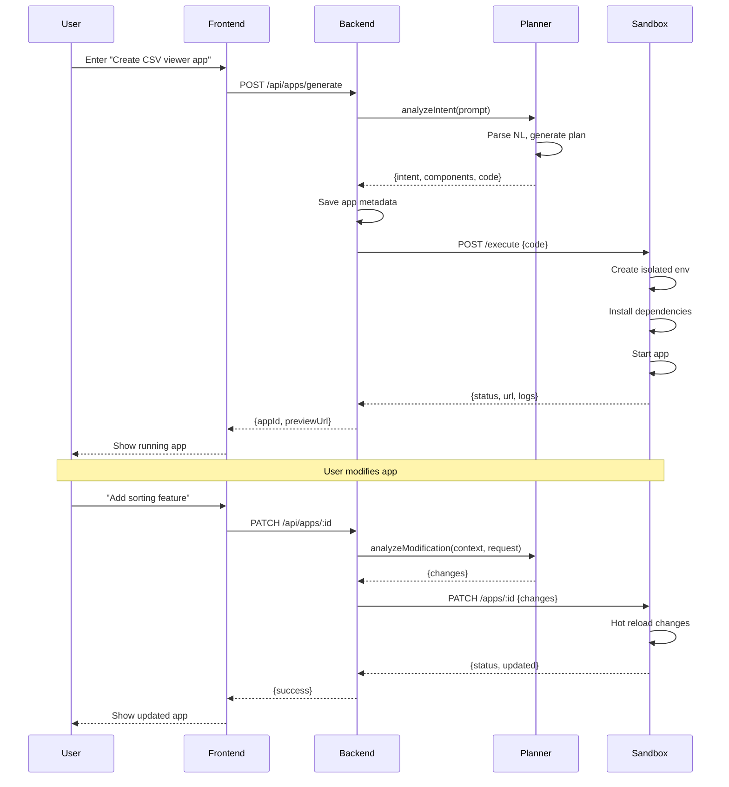
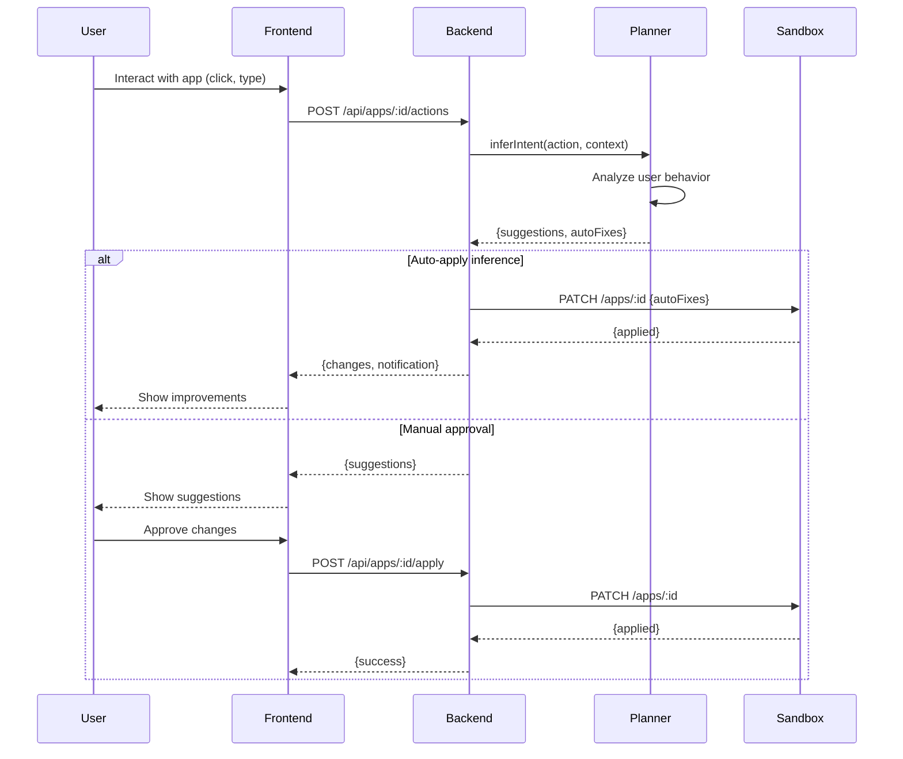

# Isekai - AI Agent System

An AI agent that turns natural language into runnable apps via live iteration with real-time modification and creation based on user actions.

## Architecture

### System Overview

The system consists of four main components:
1. **Frontend**: React-based UI for user interaction
2. **Backend**: API server coordinating requests
3. **Planner**: AI-powered natural language processor
4. **Sandbox**: Secure isolated runtime environment

### Quick Start

```bash
# Install dependencies
make install

# Start all services
make dev

# Run smoke test
make smoke-test
```

## Architecture Diagrams

### C4 Context Diagram



### C4 Container Diagram



### C4 Component Diagram - Backend



### Sequence Diagram - App Generation Flow



### Sequence Diagram - Live Iteration Flow



## API Contracts

See [API Documentation](./docs/api-contracts.md) for detailed API specifications.

## Security

The sandbox runtime provides:
- Process isolation via containers
- Network restrictions
- File system sandboxing
- Resource limits (CPU, memory, disk)
- Execution timeouts

## Development

### Prerequisites
- Node.js >= 18
- Docker (for sandbox)
- npm >= 9

### Project Structure
```
isekai/
├── packages/
│   ├── frontend/      # React UI
│   ├── backend/       # Express API server
│   ├── planner/       # NLP/AI service
│   └── sandbox/       # Isolated runtime
├── docs/              # Documentation
├── Makefile           # Build automation
└── package.json       # Root package
```

### Running Tests
```bash
make test
```

### Building for Production
```bash
make build
```

## License

MIT
## Production Upgrade Additions

This repository has been upgraded with:
- `packages/contracts` for protobuf contracts and pre-generated TS types
- `packages/observability` with OpenTelemetry and Prometheus helpers
- Per-service Dockerfiles and a local compose stack in `dev/compose`
- GitHub Actions CI with lint, test, build, and compose smoke
- Kubernetes base manifests under `deploy/k8s`
- Optional Next.js workspace at `packages/frontend-web` (imported from workspace tar if available)

### Local Dev
```
docker compose -f dev/compose/docker-compose.yml up --build
```

### Contracts
```
make -C packages/contracts gen
```

### Metrics
Each service should expose `/metrics` on its HTTP port after importing `@isekai/observability`.
