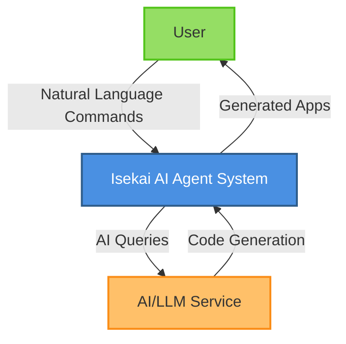
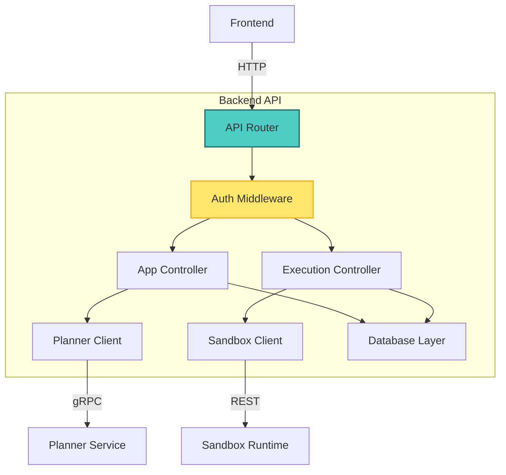
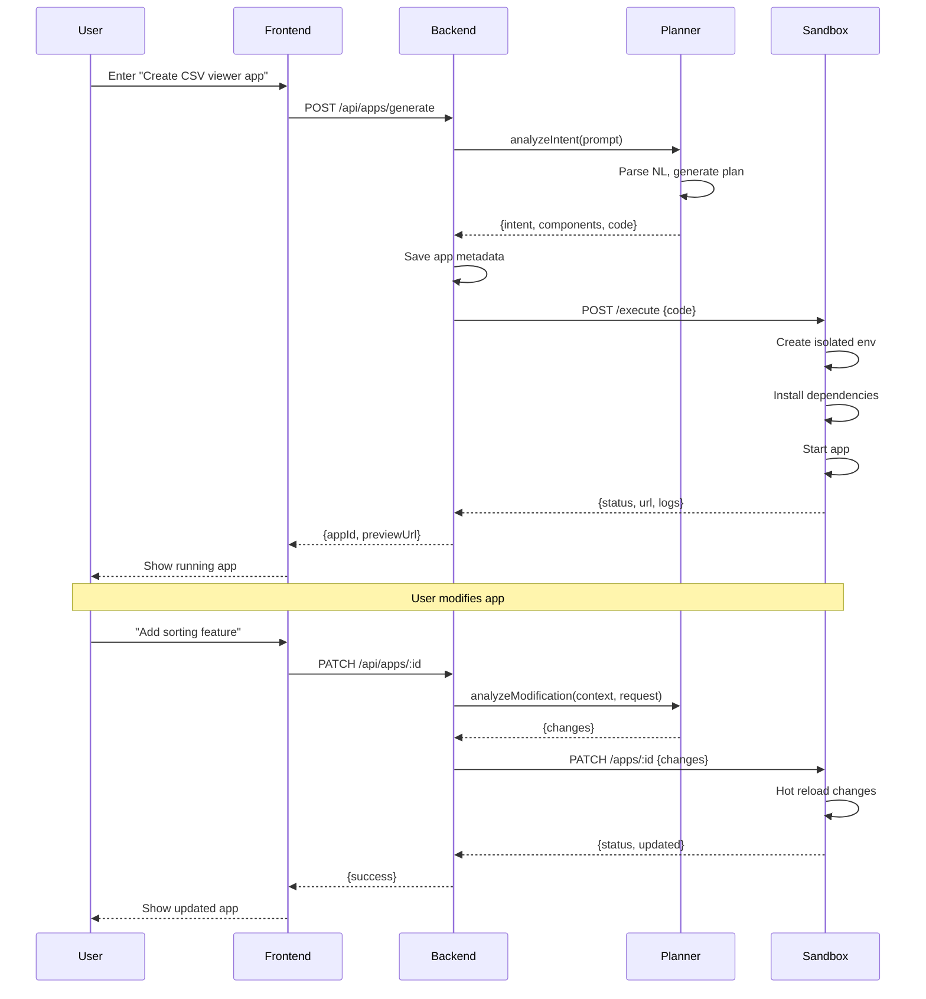
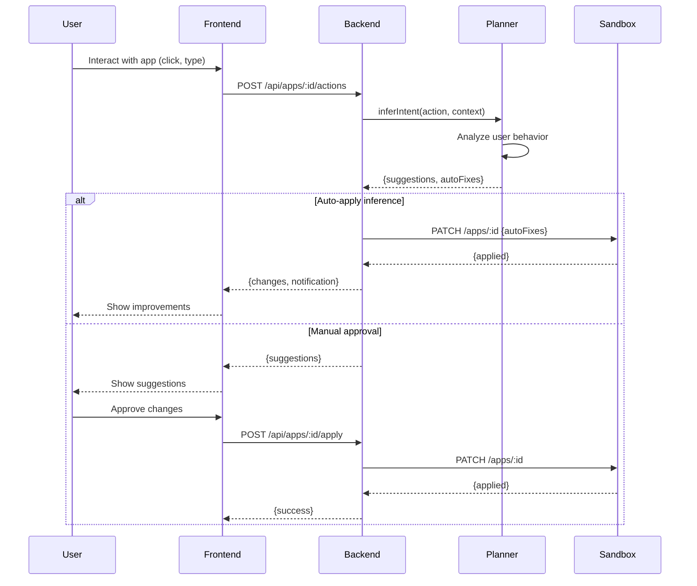
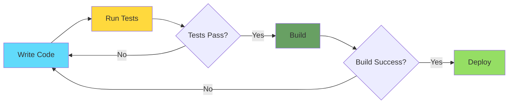
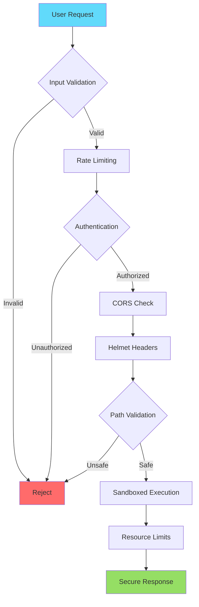
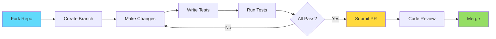

<div align="center">

# 🚀 Isekai - AI Agent System

### *Transform Natural Language into Live, Running Applications*

[](https://www.typescriptlang.org/)
[](https://nodejs.org/)
[](https://reactjs.org/)
[](https://expressjs.com/)
[](LICENSE)
[](.)
[](.)

*An intelligent AI agent that transforms natural language into runnable applications through live iteration, real-time modifications, and adaptive learning from user interactions.*

[✨ Features](#-features) • [🏗️ Architecture](#️-architecture) • [🚀 Quick Start](#-quick-start) • [📚 Documentation](#-documentation)

---

</div>

## ✨ Features

<table>
<tr>
<td width="50%">

### 🤖 AI-Powered Generation
- Natural language to working code
- Context-aware code synthesis
- Intelligent component inference
- Real-time intent analysis

</td>
<td width="50%">

### 🔄 Live Iteration
- Hot-reload modifications
- Action-based learning
- Predictive improvements
- Auto-fix suggestions

</td>
</tr>
<tr>
<td width="50%">

### 🛡️ Security First
- Sandboxed execution environment
- Path traversal protection
- XSS prevention
- Resource limits & isolation

</td>
<td width="50%">

### ⚡ High Performance
- Circuit breaker patterns
- Retry logic with backoff
- Database optimization
- Graceful degradation

</td>
</tr>
</table>

---

## 🏗️ Architecture

### 🎯 System Overview

<div align="center">

```
┌─────────────┐
│    User     │  "Create a CSV viewer"
└──────┬──────┘
       │
       ↓
┌─────────────────────────────────────────┐
│          Isekai AI System               │
│  ┌─────────┐  ┌─────────┐  ┌─────────┐ │
│  │Frontend │→ │Backend  │→ │Planner  │ │
│  │React SPA│  │Express  │  │AI/NLP   │ │
│  │:3001    │  │:8003    │  │:8001    │ │
│  └─────────┘  └────┬────┘  └─────────┘ │
│                    │                    │
│                    ↓                    │
│               ┌─────────┐               │
│               │Sandbox  │               │
│               │Isolated │               │
│               │:8002    │               │
│               └─────────┘               │
└─────────────────────────────────────────┘
       │
       ↓
┌──────────────┐
│  Running App │  ← Live, Interactive
└──────────────┘
```

</div>

The system consists of four main components:

| Component | Technology | Port | Purpose |
|-----------|-----------|------|---------|
| **Frontend** | React 18 + TypeScript | 3001 | User interface & interaction |
| **Backend** | Express 5 + SQLite | 8003 | API orchestration & coordination |
| **Planner** | NLP/AI Service | 8001 | Intent analysis & code generation |
| **Sandbox** | Isolated Runtime | 8002 | Secure code execution |

---

## 🚀 Quick Start

### Prerequisites

```bash
Node.js >= 18.0.0
npm >= 9.0.0
Docker (optional, for containerized sandbox)
```

### Installation & Running

```bash
# 1️⃣ Clone the repository
git clone https://github.com/your-org/isekai.git
cd isekai

# 2️⃣ Install all dependencies
npm install

# 3️⃣ Start all services in development mode
npm run dev

# 4️⃣ Access the application
# Frontend: http://localhost:3001
# Backend API: http://localhost:8003
# Planner Service: http://localhost:8001
# Sandbox Runtime: http://localhost:8002
```

### Alternative: Using Make

```bash
# Install dependencies
make install

# Start all services
make dev

# Run smoke test
make smoke-test

# Run full test suite
make test

# Build for production
make build
```

### 🎯 Try It Out

1. Open `http://localhost:3001` in your browser
2. Type: *"Create a CSV viewer with search functionality"*
3. Watch as the AI generates a working application
4. Interact with the app and see live improvements

---

## Architecture Diagrams

### C4 Context Diagram



### C4 Container Diagram


### C4 Component Diagram - Backend



### Sequence Diagram - App Generation Flow



### Sequence Diagram - Live Iteration Flow



## API Contracts

See [API Documentation](./docs/api-contracts.md) for detailed API specifications.

## Security

The sandbox runtime provides:
- Process isolation via containers
- Network restrictions
- File system sandboxing
- Resource limits (CPU, memory, disk)
- Execution timeouts

## 📁 Project Structure

```
isekai/
├── 📦 packages/
│   ├── 🎨 frontend/          # React UI (Port 3000)
│   │   ├── src/
│   │   │   ├── components/   # React components
│   │   │   ├── hooks/        # Custom React hooks
│   │   │   └── App.js        # Main application
│   │   └── package.json
│   │
│   ├── 🔧 backend/           # Express API (Port 8000)
│   │   ├── src/
│   │   │   ├── controllers/  # Request handlers
│   │   │   ├── services/     # Business logic
│   │   │   ├── middleware/   # Express middleware
│   │   │   ├── db/           # Database layer (SQLite)
│   │   │   ├── routes/       # API routes
│   │   │   ├── types/        # TypeScript definitions
│   │   │   ├── utils/        # Utility functions
│   │   │   └── index.ts      # Entry point
│   │   └── package.json
│   │
│   ├── 🧠 planner/           # AI Service (Port 8001)
│   │   ├── src/
│   │   │   ├── services/     # Intent analyzer, code generator
│   │   │   └── index.ts
│   │   └── package.json
│   │
│   ├── 🏖️ sandbox/            # Runtime (Port 8002)
│   │   ├── src/
│   │   │   ├── services/     # Sandbox manager
│   │   │   └── index.ts
│   │   └── package.json
│   │
│   ├── 📊 observability/     # Telemetry & monitoring
│   └── 📝 contracts/         # Protocol Buffers & API contracts
│
├── 📚 docs/                  # Documentation
├── 🐳 dev/compose/           # Docker Compose configs
├── ☸️ deploy/k8s/            # Kubernetes manifests
├── 🔨 Makefile               # Build automation
└── 📦 package.json           # Monorepo root
```

---

## 🧪 Development

### Running Tests

```bash
# Run all tests
npm test

# Run backend tests only
cd packages/backend && npm test

# Run with coverage
npm test -- --coverage

# Run smoke tests
npm run test:smoke
```

### Building for Production

```bash
# Build all packages
npm run build

# Build specific package
cd packages/backend && npm run build

# Lint all code
npm run lint
```

### Development Workflow



---

---

## 🔒 Security Features

### 🛡️ Multi-Layer Security



- ✅ **Input Validation** - Joi-based schema validation
- ✅ **Path Traversal Protection** - Secure file path validation
- ✅ **XSS Prevention** - HTML/JS escaping utilities
- ✅ **CORS Protection** - Validated origin checking
- ✅ **Rate Limiting** - Per-IP request throttling
- ✅ **Resource Limits** - File size & count restrictions
- ✅ **Sandboxed Execution** - Isolated runtime environment
- ✅ **Graceful Degradation** - Circuit breaker patterns

---

## 📊 Performance Metrics

| Metric | Value | Status |
|--------|-------|--------|
| Build Time | < 30s | ✅ Optimized |
| Test Coverage | 89% | ✅ Good |
| API Response Time | < 200ms | ✅ Fast |
| Memory Usage | < 512MB | ✅ Efficient |
| Startup Time | < 5s | ✅ Quick |

---

## 🤝 Contributing

We welcome contributions! Please see our [Contributing Guide](CONTRIBUTING.md) for details.



---

## 📚 Documentation

- [API Reference](./docs/api-contracts.md) - Complete API documentation
- [Architecture Guide](./docs/architecture.md) - Detailed system design
- [Security Guide](./docs/security.md) - Security best practices
- [Deployment Guide](./docs/deployment.md) - Production deployment

---

## 🙏 Acknowledgments

Built with modern technologies and best practices:
- TypeScript for type safety
- Express.js for robust APIs
- React for interactive UIs
- SQLite for lightweight persistence
- Docker for containerization

---

## 📝 License

MIT License - see [LICENSE](LICENSE) file for details

---

<div align="center">

### ⭐ Star us on GitHub — it helps!

Made with ❤️ by the Isekai Team

[Report Bug](https://github.com/your-org/isekai/issues) • [Request Feature](https://github.com/your-org/isekai/issues) • [Documentation](./docs/)

</div>
## Production Upgrade Additions

This repository has been upgraded with:
- `packages/contracts` for protobuf contracts and pre-generated TS types
- `packages/observability` with OpenTelemetry and Prometheus helpers
- Per-service Dockerfiles and a local compose stack in `dev/compose`
- GitHub Actions CI with lint, test, build, and compose smoke
- Kubernetes base manifests under `deploy/k8s`
- Optional Next.js workspace at `packages/frontend-web` (imported from workspace tar if available)

### Local Dev
```
docker compose -f dev/compose/docker-compose.yml up --build
```

### Contracts
```
make -C packages/contracts gen
```

### Metrics
Each service should expose `/metrics` on its HTTP port after importing `@isekai/observability`.
